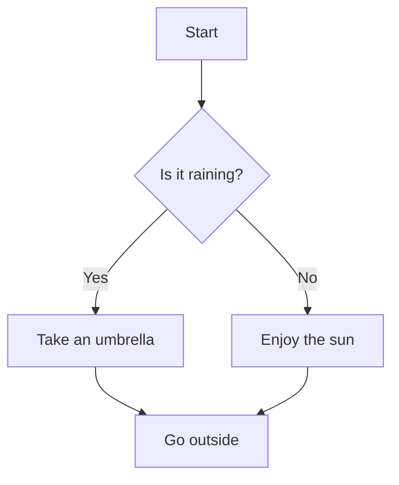
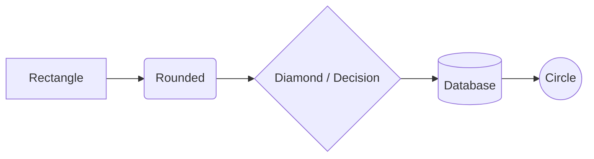

# Mermaid — Flowcharts

[Mermaid](https://mermaid.js.org) lets you create diagrams from text inside fenced code blocks with the `mermaid` language tag. GitHub renders these natively.

**Syntax:**

````markdown

````

**Rendered:**


---

## Node Shapes



---

## Direction Options

| Code | Direction |
| :--- | :--- |
| `TD` or `TB` | Top → Down |
| `LR` | Left → Right |
| `RL` | Right → Left |
| `BT` | Bottom → Top |

> ✅ Supported natively on GitHub since 2022. For other platforms, use [mermaid.live](https://mermaid.live) to preview.
