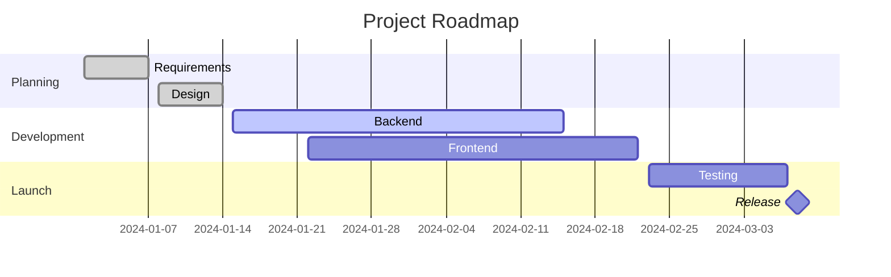

# Mermaid — Gantt Charts

Gantt charts are great for project timelines and roadmaps.

**Syntax:**

````markdown

````

**Rendered:**


---

## Task Status Tags

| Tag | Meaning |
| :-- | :------ |
| `done` | Completed task (grey) |
| `active` | In progress (blue) |
| `crit` | Critical path (red) |
| `milestone` | Zero-duration milestone marker |
