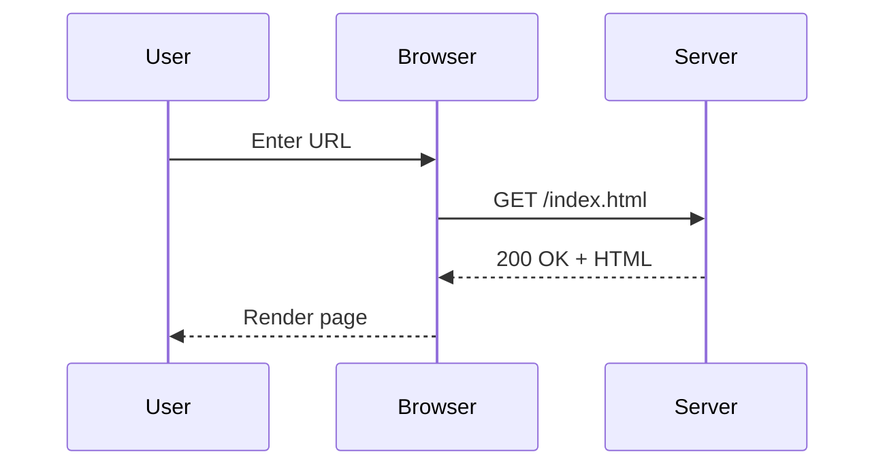
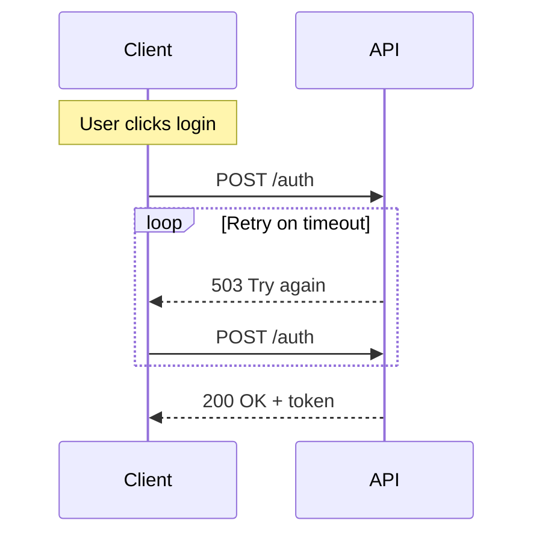

# Mermaid — Sequence Diagrams

Sequence diagrams show how processes interact over time.

**Syntax:**

````markdown

````

**Rendered:**


---

## Arrow Types

| Syntax | Meaning |
| :----- | :------ |
| `A->>B` | Solid arrow (request) |
| `A-->>B` | Dashed arrow (response) |
| `A-xB` | Solid with X (async/lost) |
| `A--xB` | Dashed with X |

---

## With Notes and Loops


